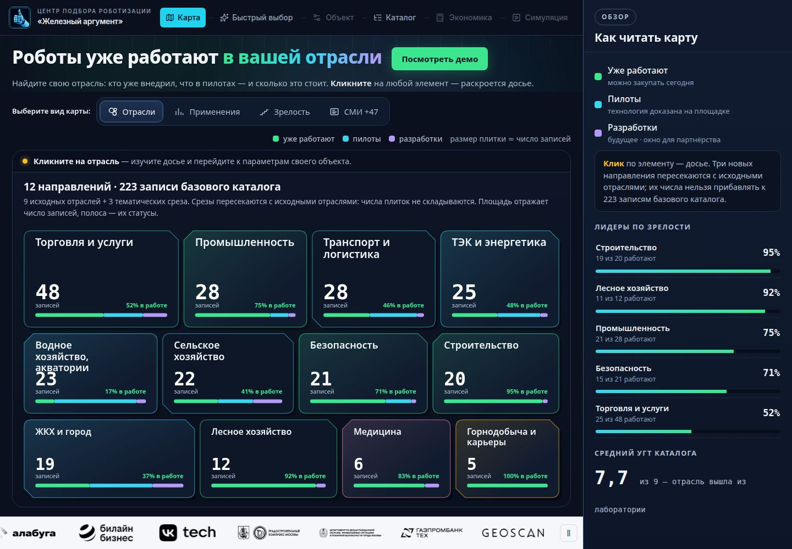
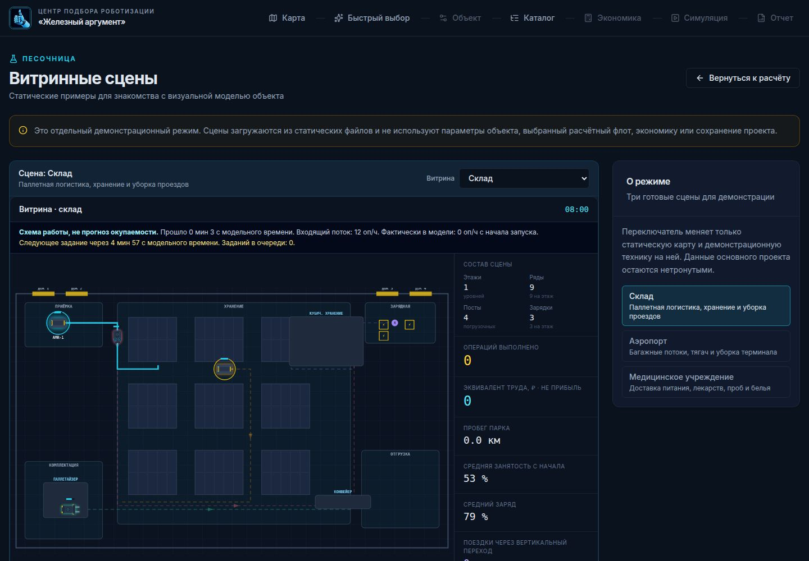

# RobotsHub — центр подбора роботизации

Веб-приложение для изучения отраслевой карты робототехники, описания площадки, сравнения решений и предварительной оценки внедрения. Интерфейс на русском языке.

[](https://github.com/Shurik-9/robotshub/actions/workflows/verify.yml)
[](LICENSE)
[](#запуск-для-проверяющего-docker-compose)





## Живая версия

Откройте [robotshub.ru](https://robotshub.ru/) без установки. Для воспроизводимой проверки исходного кода используйте локальный запуск ниже. Новые изменения в рабочей копии могут появиться на публичном сайте только после следующей публикации.

## Запуск для проверяющего: Docker Compose

Понадобятся Docker с Compose v2, доступ к Docker Hub и npm при первой сборке, свободный порт 8080 и рекомендуемые 4 ГБ оперативной памяти для сборки. Репозиторий открыт: для клонирования аккаунт GitHub не требуется.

```bash
git clone https://github.com/Shurik-9/robotshub.git
cd robotshub
docker compose up --build --wait
```

Откройте **http://localhost:8080**. Проверка работоспособности:

```bash
curl -f http://localhost:8080/healthz
curl -f http://localhost:8080/map/map-data.json
curl -f 'http://localhost:8080/quick-select?sector=sector-medicine'
```

Последняя команда проверяет, что сервер отдаёт страницу и для внутренних маршрутов приложения. Открывать её для интерактивной проверки нужно в браузере. Сборка идёт для `linux/amd64`; на ARM/Mac с Apple Silicon Docker использует эмуляцию и первая сборка может быть медленнее. В контейнере работает только статический веб‑сайт; исходный API‑сервер здесь не требуется и не запускается.

Если 8080 занят, создайте `.env` из `.env.example` и измените `WEB_PORT` (например, на 18080). После изменения порта используйте `http://localhost:<WEB_PORT>`. Переменная не содержит секретов.

Остановить: `docker compose down`. Логи: `docker compose logs --tail=100 web`. Состояние: `docker compose ps`. При сбое сборки: проверьте доступ к Docker Hub/npm и повторите `docker compose build --no-cache web`. Если `/healthz` отвечает, а внутренняя страница не открывается, проверьте `docker compose logs web`; конфигурация веб-сервера находится в `deploy/nginx.conf`.

## Что проверить в браузере

1. На главной странице выберите отрасль на карте и нажмите переход к описанию объекта.
2. На «Быстром выборе» изучите отраслевые доказательства и выберите один из трёх типовых объектов или «Свой объект».
3. Сохраните параметры объекта и изучите отфильтрованный каталог.
4. Для поддерживаемого сценария посмотрите предварительную экономику; для неподдерживаемого — явное объяснение ограничения вместо фиктивных чисел.
5. **Симуляция.** После выбора подходящего решения перейдите из расчёта в «Симуляцию»: роботы выполняют задания на схеме вашей площадки с проездами, этажами и лифтом. Без расчётного проекта откройте [демонстрационную сцену склада](https://robotshub.ru/simulation/sandbox): конвейер, паллетайзер и манипулятор показаны в отдельной песочнице. Это схема работы техники, а не прогноз окупаемости; песочница не использует параметры вашего проекта.
6. Откройте отчёт, затем обновите страницу: данные вашего проекта сохраняются **только в локальном хранилище этого браузера**. При очистке данных сайта или переходе на другое устройство они не переносятся.

Подробнее: [маршрут проверки](docs/REVIEWER_GUIDE.md), [статус функций](docs/STATUS.md) и [команды проверки](docs/VALIDATION.md).

## Запуск разработчика без Docker

Официально воспроизводимый сценарий выше — Docker. Для разработки на Linux x86‑64 нужны Node.js 24 и pnpm 10.26.1:

```bash
pnpm install --frozen-lockfile
pnpm --filter @workspace/robotshub run dev
```

Откройте http://localhost:5173. `PORT` и `BASE_PATH` необязательны (по умолчанию 5173 и `/`). Для сборки: `pnpm --filter @workspace/robotshub run build`. Текущий lockfile ограничивает нативные зависимости архитектурой x86‑64: на других архитектурах используйте Docker Compose.

## Устройство и ограничения

Основной интерфейс — React/Vite в `artifacts/robotshub`, данные карты и каталога входят в репозиторий. Симуляция работает на собственном движке Canvas 2D (автомат состояний, маршруты A* по проездам, лифт и зарядка) без внешних сервисов. Docker собирает сайт и раздаёт `dist/public` через nginx; внутренние URL перенаправляются на `index.html`. `artifacts/api-server` и `lib/db` — отдельный неиспользуемый сейчас каркас API с требованием PostgreSQL. Поднимать его для проверки сайта **не нужно**. Подробности — в [архитектуре](docs/ARCHITECTURE.md).

ТЭО — предварительная модель с ограничениями области применимости, а не финансовая гарантия.

Исходный код распространяется по [MIT](LICENSE). Фотографии техники, логотипы и материалы третьих лиц остаются собственностью их правообладателей; ссылки на источники приведены в карточках и документации, лицензия MIT не распространяется на эти материалы.